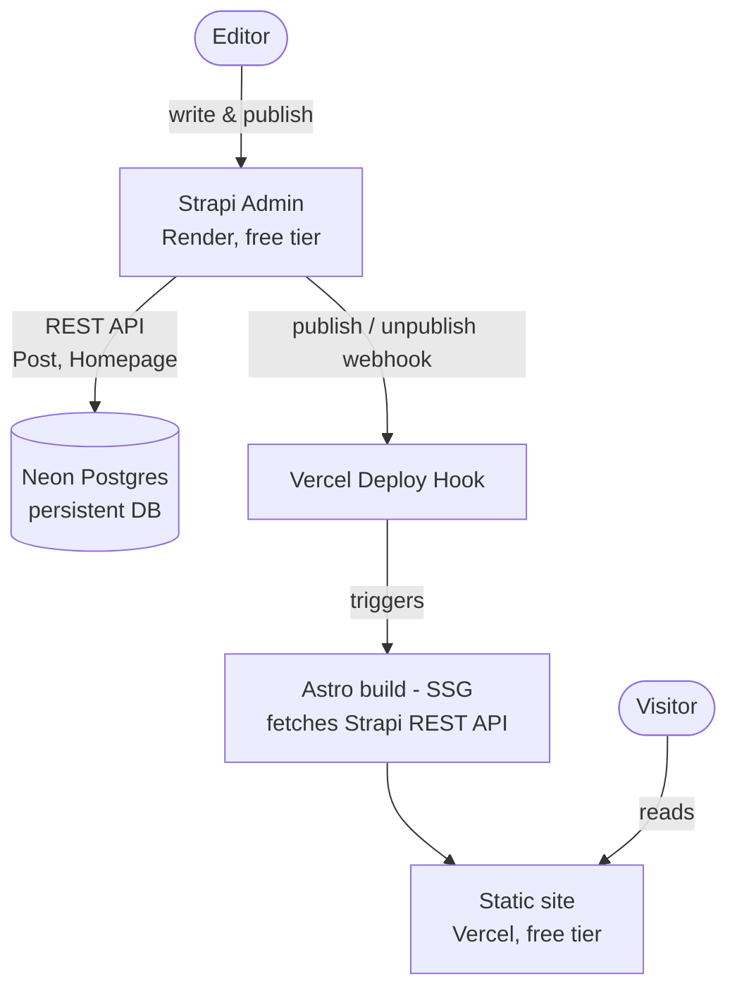

# Security News Blog

A small, content-first publication about AI security topics, built to demonstrate a full headless CMS pipeline end to end: non-technical editors publish from a CMS admin panel, and a fully static site rebuilds itself automatically.

- **Live site:** https://security-news-blog-web.vercel.app
- **Headless CMS server:** https://security-news-blog-cms.onrender.com

## Architecture



Key properties:

- **Build-time data fetching (SSG).** Astro fetches Strapi's REST API only at build time. The public site is pure static HTML, CMS availability and cold starts never affect visitors.
- **Persistent external database.** Strapi's default SQLite lives on the local filesystem; on hosts with ephemeral disks (Render free tier) it's wiped on every restart. Pointing Strapi at Neon Postgres makes the data survive restarts and redeploys.
- **Publish-triggered rebuilds.** A Strapi webhook (fires on publish/unpublish) calls a Vercel Deploy Hook, which rebuilds the static site: editors see their changes live in about 20 seconds, with no manual redeploy step.
- **Cold starts are acceptable.** Render's free tier sleeps the Strapi service after ~15 min idle (~30–60s wake). This only affects the admin panel, never the public site.

## Tech stack

| Layer    | Choice                            | Why                                                                                               |
| -------- | --------------------------------- | ------------------------------------------------------------------------------------------------- |
| Frontend | Astro + Tailwind CSS v4 + Preline | Content site: static output, zero client JS by default, content-driven routing (`getStaticPaths`) |
| CMS      | Strapi (self-hosted, Render)      | Auto-generated REST API, schema lives in git, exercises the full stack end to end                 |
| Database | Neon Postgres                     | Managed, persistent, survives Strapi restarts, unlike ephemeral-disk SQLite                       |
| Hosting  | Vercel (site) + Render (CMS)      | Free tiers; Vercel Deploy Hook + Strapi webhook wire the two together                             |

## Repo layout

Plain monorepo: one GitHub repo holds both the frontend (`web/`) and backend (`cms/`) as independent apps, each with its own `package.json` and deploy target. No shared workspace tooling (Turborepo, npm workspaces) since the two apps share zero code.

```
security-news-blog/
  cms/     # Strapi app (own package.json)
  web/     # Astro app (own package.json)
  docs/    # planning docs (PRD.md)
```

- `.gitignore` per folder: `node_modules`, `.env`, `cms/.tmp/`
- Secrets (Neon connection string, Strapi admin secrets) live in platform env vars, not in git
- Deploy config:
  - Vercel Root Directory = `web/`
  - Render Root Directory = `cms/`

## Content model

- **Homepage**: Single Type: `title`, `tagline`
- **Post**: Collection Type: `title`, `slug` (auto-generated from title), `excerpt`, `body` (rich text markdown)

No custom date/author fields, Strapi provides them as system fields:

- `publishedAt` — set automatically by Draft & Publish on publish
- `updatedAt` — last-edited timestamp, bumped on every save by any editor
- `createdBy` — the admin user who created the entry, auto-populated (firstname/lastname only)

## Editorial roles

- **Super Admin**: schema, settings, users
- **Editor**: create / edit / publish any post; no access to schema, settings, tokens, or users

Both roles can edit any post; Strapi's `createdBy`/`updatedAt` attribute authorship and last edit automatically. This mirrors a real newsroom setup: developers own the model, editors own the words.

## Local development

```bash
# CMS
cd cms
npm install
npm run develop   # http://localhost:1337/admin

# Site
cd web
npm install
npm run dev        # http://localhost:4321
```

The site fetches from the deployed Strapi instance by default (see `web/src/pages/index.astro` and `web/src/pages/posts/[slug].astro`), point it at `http://localhost:1337` to develop against a local CMS instead.
